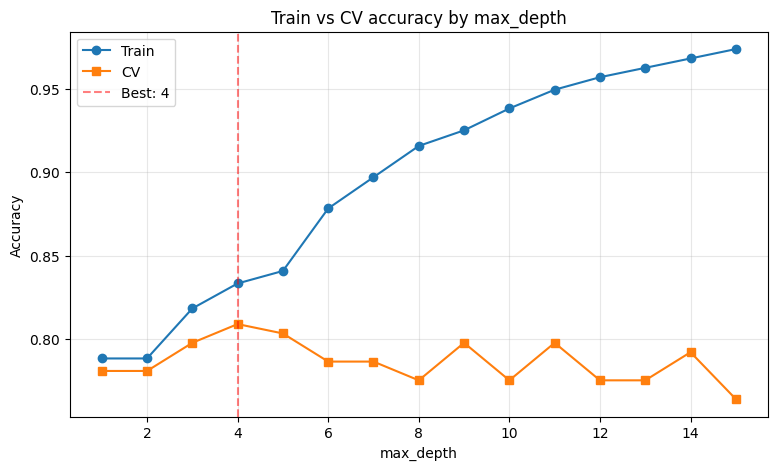
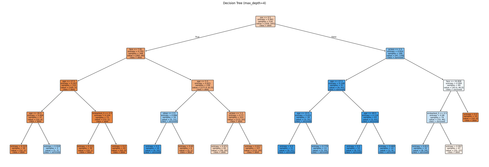
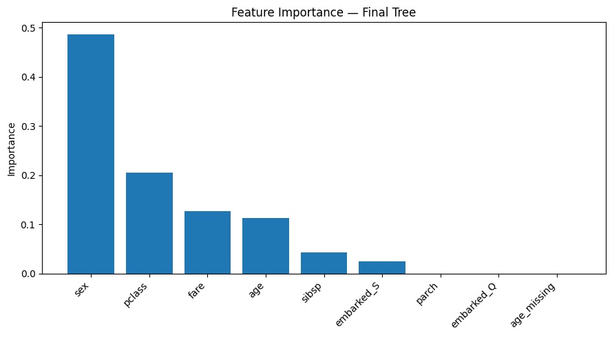

# Decision Tree — Titanic Survival Prediction

A decision tree classifier trained on the Titanic dataset to predict passenger survival.
The full code lives in `decision_tree_titanic.py` and the generated plots in the `images/` folder.

This README walks through the steps of the exercise, explaining the reasoning behind each decision.

## 1. Setup

The script imports `pandas`, `numpy`, `matplotlib`, `seaborn`, and `sklearn`.
A constant `IMAGES_DIR` based on `Path(__file__).parent / 'images'` is used so the images are always saved in the right place, regardless of the current working directory when the script is run.

## 2. Data treatment

The dataset is loaded directly from seaborn (`sns.load_dataset('titanic')`).
After loading, the script prints the shape, data types, null counts, and target distribution to give a quick overview of what we're dealing with.

### Dropping columns

```python
df = df.drop(columns=['alive', 'class', 'embark_town', 'who',
                      'adult_male', 'alone', 'deck'])
```

These columns were removed for three different reasons:

- **Data leakage**: `alive` is just `survived` in string form ("yes"/"no"). Keeping it would let the model "cheat" by reading the answer directly.
- **Redundancy**: `class` duplicates `pclass`, and `embark_town` duplicates `embarked`.
- **Engineered duplicates**: `who`, `adult_male`, and `alone` are derived from `sex`, `age`, `sibsp`, and `parch`. The tree can learn those rules on its own from the raw columns.
- **Too many nulls**: `deck` has ~688 missing values out of 891 (77%). Imputing that much would invent more data than is honest.

### Null treatment

`age` has 177 missing values (~20% of the dataset). Dropping those rows would lose too much data, so the nulls are filled with the median age. A binary flag `age_missing` is also created **before** imputation, so the model can learn whether the absence of age itself carries any signal.

`embarked` has only 2 nulls, filled with the mode (the most common embarkation port).

### Feature encoding

Decision trees only accept numerical input, so categorical features need to be converted:

- `sex`: binary, mapped directly to `{male: 0, female: 1}`.
- `embarked`: 3 categories (C, Q, S), one-hot encoded with `drop_first=True` to avoid redundancy (3 categories only need 2 columns to be uniquely identified).

> Note: decision trees do **not** require feature scaling (Z-score, min-max, etc.). They split on absolute values, so feature scale is irrelevant.

## 3. Data splitting

The data is split into train (60%), cross-validation (20%), and test (20%) using two consecutive `train_test_split` calls. The `stratify=y` argument keeps the proportion of survivors balanced across all three sets.

```
Train: 534 rows (60%)
CV:    178 rows (20%)
Test:  179 rows (20%)

Survived ratio — train: 0.384, cv: 0.382, test: 0.385
```

The matching ratios confirm the stratified split worked correctly.

## 4. Baseline model

A first model is trained with no `max_depth` restriction, just to see what happens when the tree is allowed to grow freely:

```
Train accuracy: 0.9869
CV accuracy:    0.7640
Tree depth:     22
Leaves:         124
```

This is textbook **overfitting**: the model nearly memorizes the training set (98.69%) but generalizes poorly (76.40%). The 22-level deep tree with 124 leaves is essentially memorizing individual passengers rather than learning patterns.

## 5. Hyperparameter tuning

To find the right level of tree complexity, the script trains 15 trees with `max_depth` ranging from 1 to 15, evaluating each on the train and CV sets:

```
depth= 1  train=0.7884  cv=0.7809
depth= 2  train=0.7996  cv=0.7865
depth= 3  train=0.8258  cv=0.8034
depth= 4  train=0.8315  cv=0.8090  ← best
depth= 5  train=0.8596  cv=0.7809
...
depth=15  train=0.9850  cv=0.7584
```

> *Plot built with assistance from Claude Code.*



The shape of the curve tells the story: train accuracy keeps climbing as depth increases, but CV accuracy peaks at `max_depth=4` and then degrades. Anything beyond that is fitting noise rather than signal.

## 6. Final model

The final model is trained with `max_depth=4` and `criterion='entropy'`, the configuration that performed best on the CV set.

### Tree visualization

> *Plot built with assistance from Claude Code.*



Each node shows:
- The split condition (e.g., `sex <= 0.5`)
- The entropy of the node
- The number of samples
- The class distribution `[died, survived]`
- The majority class

The root node splits on `sex`, which is the strongest predictor of survival in the Titanic.

### Feature importance

> *Plot built with assistance from Claude Code.*



```
sex          0.4866
pclass       0.2053
fare         0.1266
age          0.1137
sibsp        0.0432
embarked_S   0.0245
parch        0.0000
embarked_Q   0.0000
age_missing  0.0000
```

`sex` dominates with nearly half of the total importance, which matches the historical "women and children first" policy. `pclass` and `fare` follow as the next most informative features.

Three features ended up with zero importance: `parch`, `embarked_Q`, and `age_missing`. The `age_missing` flag — added under the assumption that "not knowing the age" might itself be a signal — turned out to be useless for this model. A good reminder that not every piece of feature engineering pays off.

## 7. Test set evaluation

After tuning, the model is evaluated **once** on the untouched test set to estimate real-world performance:

```
Accuracy on test: 0.8380
Accuracy on cv:   0.8090
```

Test accuracy slightly exceeds CV accuracy, which is a healthy sign — the model generalizes well and the chosen `max_depth` was not overfit to the CV split.

### Classification report

```
              precision  recall  f1-score  support
died             0.81     0.95     0.88      110
survived         0.90     0.65     0.76       69

accuracy                           0.84      179
```

The model is more confident predicting deaths than survival: it catches 95% of the actual deaths (recall) but only 65% of the actual survivors. This is a typical bias toward the majority class in imbalanced datasets (62% of passengers died).

### Confusion matrix

```
                 pred died  pred survived
actual died            105              5
actual survived         24             45
```

24 actual survivors were misclassified as deaths — about a third of all survivors. This could be improved with techniques like `class_weight='balanced'` or threshold tuning.

## Key takeaways

- Decision trees overfit aggressively when unrestricted; controlling `max_depth` is the main lever for regularization.
- Feature scaling is unnecessary for tree-based models.
- The default `gini` and `entropy` criteria produce nearly identical results in practice; the bigger gains come from depth tuning and clean data.
- Always check for **data leakage** in the dataset (the `alive` column was a perfect example — it would give the model the answer directly).
- Tree-based models offer interpretability that neural networks don't: you can read each split as a rule and explain individual predictions.

## Requirements

```bash
pip install scikit-learn pandas numpy seaborn matplotlib
```

## Usage

```bash
python decision_tree_titanic.py
```

The script prints the EDA, training results, tuning table, feature importance, and final test evaluation to the terminal, and saves three plots to the `images/` folder:

- `depth_tuning.png` — train vs CV accuracy by max_depth
- `final_tree.png` — the trained decision tree
- `feature_importance.png` — feature importance bar chart

---

*Studies guided by Andrew Ng's Machine Learning Specialization.*
